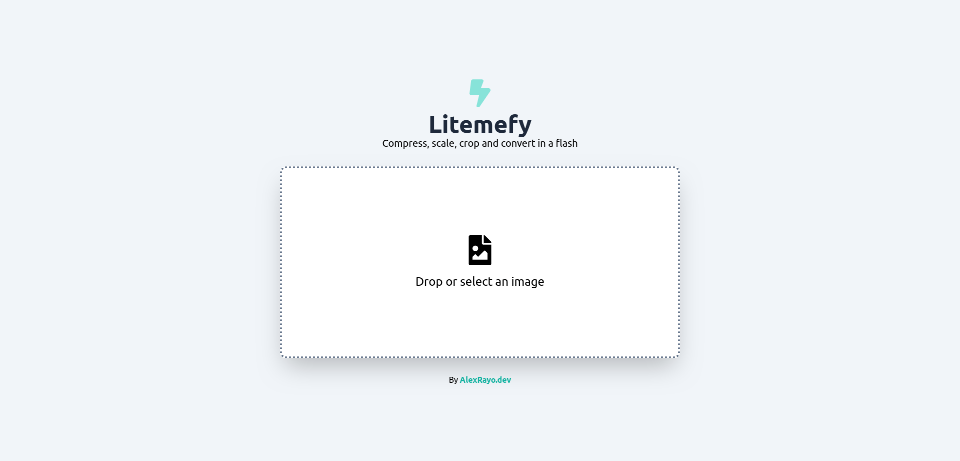

# Litemefy

Litemefy is a web tool that allows you to reduce the size of your images to improve the loading speed of your websites and applications, while also offering other useful image editing features.

## Demo

You can see a live demonstration of Litemefy [here](https://litemefy.vercel.app/).

## Description

Litemefy was born to solve common problems when working with images on the web. The application enables you to reduce the size of your images, convert them to the WebP format, and perform other basic edits all in one place. No more need for multiple tools.

## Features

- Automatically compresses images to improve loading speed.
- Converts images to the WebP format for better performance.
- Performs basic edits such as cropping, scale and rotation.
- Supports PNG images while preserving transparency.
- Intuitive and user-friendly interface.

## Usage

Litemefy is easy to use. Upload your images, make necessary edits, and download the optimized version. Here's an example of how to use it:

1. Click on "Upload Image" or drag an image into the upload area.
2. Make edits if necessary using the provided tools.
3. Optionally, convert the image to WebP by clicking "WebP".
4. Download the optimized image by clicking the download button.

## Development

1. Clone this repository: `git clone https://github.com/yourusername/litemefy.git`
2. Navigate to the project directory: `cd litemefy`
3. Install dependencies: `npm install`
4. Start the application: `npm start`

## Contribution

We would love for you to contribute to improving Litemefy! If you'd like to contribute, follow these steps:

1. Fork this repository.
2. Create a branch for your changes: `git checkout -b my-feature`
3. Make your changes and ensure they adhere to the style guidelines.
4. Submit a pull request when you're ready.

## License

This project is licensed under the [MIT License](LICENSE.md). See the [LICENSE.md](LICENSE.md) file for more details.
